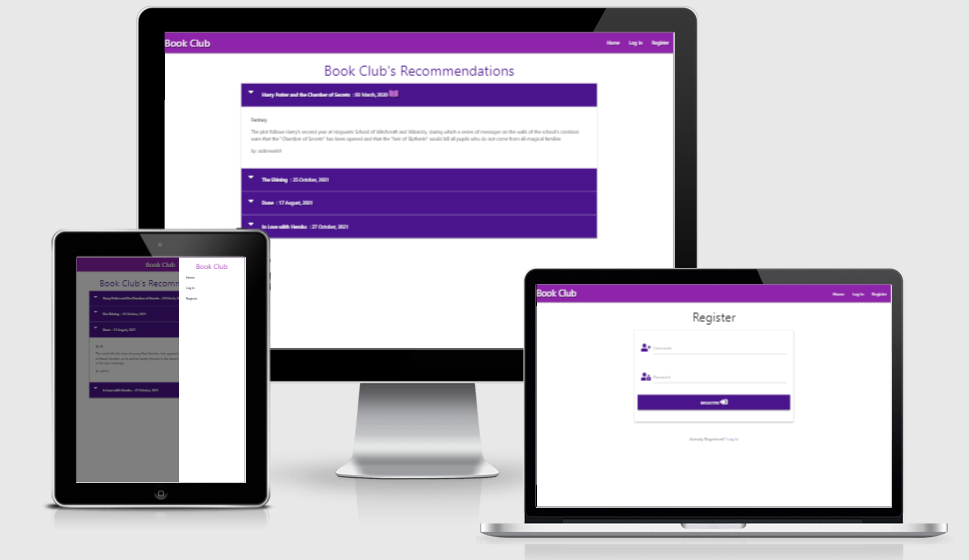
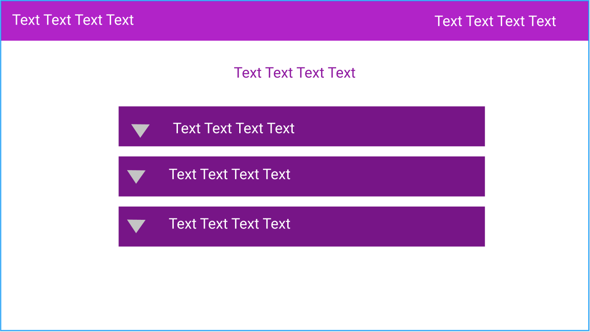
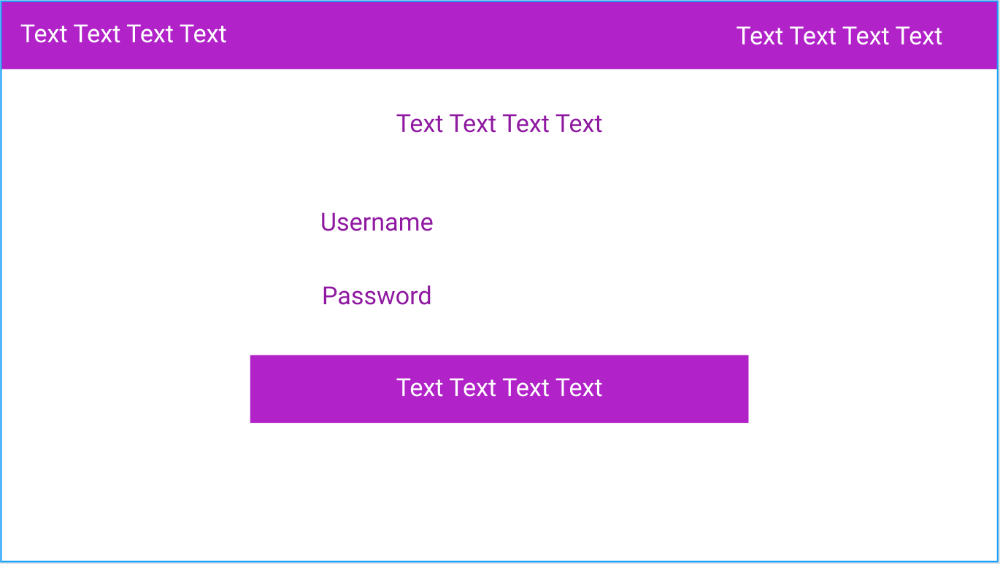
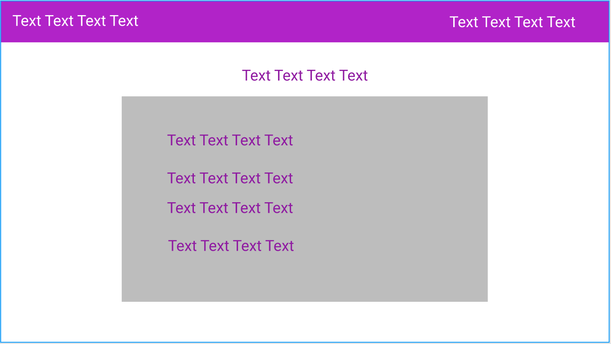
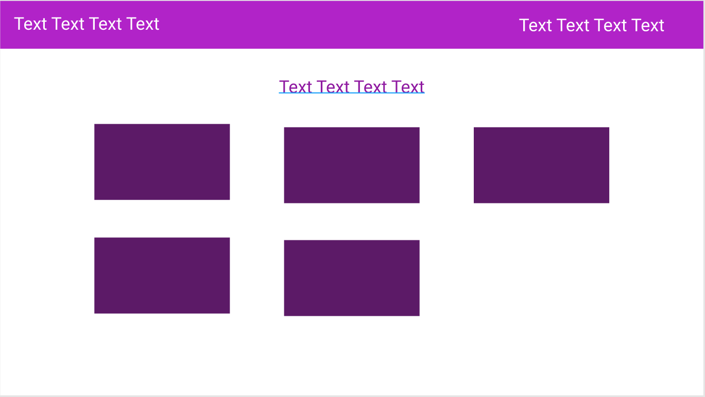

# Aidan's Arcade

## Code Institute: Milestone Project 3

https://flask-book-club-project.herokuapp.com/
***

## Introduction

Book Club -  Backend Development - Code Institute

The goal of Book Club is to welcome all book worms alike to join together as a little community to share our books together, and our thoughts/reviews on the books that might interest others to check out the adventures they've missed out on!

Book Club was created with book worms in mind, who like to socialise and is not afraid of sharing ideas. Most of these users will be in a book store, outside and/or in lockdown! This website is designed to be a place that can be accessed from anywhere.

This is my third of four Milestone Porjects that I must complete during the Full Stack Development Program over at Code Institute.
The primarily requirements for this milestone is to make a backend development website with the use of **HTML, CSS, JavaScript, Python+Flask, MongoDB**.
***

## UX

This project follows a CRUD (Create, Read, Update and Delete) system with a search function to narrow the reviews down by certain titles or just genres.

It has a clean, simplistic and minimal design to not make the screen too distracting, so the users will be greeted with book titles, and an easy to use navigation system.

### User Goals

1. To view other users book reviews.
2. To create an account on the site.
3. To add a review of their own and edit any existing ones they have.

### User Stories

1. I want to see book review summaries when I go to the home page of the site.
2. The full book review should show the original user who created the post.
3. The full book review should show what category/genre the book has been assigned to.
4. The full book review should show the book name, genre, synopsis, users review, a 'would read again' icon (if users really liked the book) and the user who posted it.
5. I would like to be able to register an account so I can create my own reviews.
6. I would like to be able to log in without issues when I use the correct log in details.
7. I should not be able to edit or delete a review that is not mine.
8. On the book review page, I want to be able to delete or edit my reviews.
9. I want the abilty to view my profile.
10. There should be options to register and login on the site navigation.
11. If im logged in i should see navigation options to log out, and view my profile.
12. If I encounter an error in rendering a page, I want to know what type of error it is, so I can research on how to solve the problems on my end.

#### Admin Exlusive stories

1. I want to be able to manage the categories' database with ease, using only the website.

### Development Planes

In order to create an engaging website, the developer used their own passion for books to help create a simplistic, and fast design for a virtual book club.

#### Home Wireframe

#### Login Wireframe

#### Add Book Wireframe

#### Manage Categories Wireframe

###  Design

The whole UI is made utilizing frameworks using Flask, PyMongo, Jijna and Materialize.
Offical documents are listed below.

- [Flask](https://flask.palletsprojects.com/en/2.1.x/)
- [PyMongo](https://pymongo.readthedocs.io/en/stable/)
- [Jinja](https://jinja.palletsprojects.com/en/3.1.x/)
- [Materialize](https://materializecss.com/)
***

## MVP

✅ Fully responsive. 
✅ Check out book reviews/thoughts by other users. 
✅ Register a new account and login. 
✅ Share a book review. 
✅ Staff users can edit categories/genres. 

### Existing Features

- **New Account**  
To access the page the user must use their credentials to register. In the case of this build there is also an option to login as a "admin" which allows the user experience the application utilizing a premade account. (refer to testing section).

- **Profile**  
Shows your account information such as your username, and a button that takes you write up your own review.

- **Book Category**  
Books are divided into different categories. 

- **Reviews**  
Users can share their thoughts/reviews on the books they've read. 

- **CRUD**  
Website acts as a fully functional CRUD system. Create, Read, Update, Delete. (Users may only apply updates and deletes to their own posts.)

- **Search Engine**  
Users will be able to limit what they see with the newly implemented search engine, for example "fantasy" will search for all fantasy book reviews.

- **Error routes**  
Users will be greeted with either 400, 404 or 500 errors if they were to encounter any.
***

## Technologies Used

### Programs Used
- [HTML5](https://en.wikipedia.org/wiki/HTML5 "Link to HTML Wiki")
- [CSS3](https://en.wikipedia.org/wiki/Cascading_Style_Sheets "Link to CSS Wiki")
- [JS](https://en.wikipedia.org/wiki/JavaScript "Link to JS Wiki")
- [Python](https://en.wikipedia.org/wiki/Python_(programming_language) "Link to Python Wiki")
- [MongoDB](https://en.wikipedia.org/wiki/MongoDB "Link to MongoDB Wiki")

### Frameworks and Tools Used
- [W3C Markup Validation Service](https://validator.w3.org/) - Used to check the validity and efficiency of the HTML and CSS code base.
- [Flask](https://en.wikipedia.org/wiki/Flask_(web_framework) "Link to Flask wiki")
- [PyMongo](https://docs.mongodb.com/drivers/pymongo/) - Used as drivers for Python to connect and work with MongoDB
- [Materialize](https://materializecss.com/ "Link to Materialize page")
     - Materialize was used to implement the responsiveness of the site, using Materialize classes, and to add many features.
- [Font Awesome](https://fontawesome.com/ "Link to FontAwesome")
     - Font Awesome was used on all pages throughout the website to import icons for UX purposes.
- [Git](https://git-scm.com/ "Link to Git homepage")
     - Git was used for version control by utilising the GitPod terminal to commit to Git and push to GitHub.
- [GitHub](https://github.com/ "Link to GitHub")
     - GitHub was used to store the project after pushing
- [Heroku](https://heroku.com/ "Link to Heroku")
     - Heroku was used to deploy the project
- [Am I Responsive?](http://ami.responsivedesign.is/ "Link to Am I Responsive Homepage")
     - Am I Responsive was used in order to see responsive design throughout the process and to generate mockup imagery to be used.
***

## Testing

Based on the User Stories above, all users will be able to follow the flow of the website to find what they came for according to their stories.

Google developer tools was used manually to check and test the live project on all different screen sizes. Used multiple devices and feedback from family & friends who went to the deployed site on their devices.

Refer to the tests.md attached to this repo for detailed tests.

### Test Account

For testing purposes, there is already a premade user + admin account to experiment with. Feel free to create your own accounts too!

#### Admin
- User = admin
- Password = Admin

#### Test User
- User = tester
- Password = itestthings

### UX Test for both Mobile & Desktop (Little outdated, but still valid)

[Mobile](https://youtu.be/67SZCd8ntxQ)

[Desktop](https://youtu.be/U6o6Q99XF08)
***

## Deployment

This website was developed in multiple editors, Gitpod and vsCode, and version controlling was utilised via local (git) and online (github) repository technologies, then deployed on Heroku.

### Deploying this application was achieved through Heroku by;

1. First create env file where you will put:
- Import os
- IP set on 0.0.0.0  or your own
- MONGODB_NAME Name of your MONGODB collection
- MONGO_URL link to your MONGODB cluster - to do this you have to open your mongodb > go to Clusters> under your Cluster name click the button connect, then choose Connect your application. Choose the second option which is add your connection string. Copy your string in the field.
- SECRET_KEY - set it as the most difficult key what you can think about, I used for that page [Randomkeygen](https://randomkeygen.com/)
- PORT set as 5000 or as you want

your env.py should look like :

import os

os.environ.setdefault("IP", "0.0.0.0")
os.environ.setdefault("PORT", "5000")
os.environ.setdefault("SECRET_KEY", "yourkey")
os.environ.setdefault("MONGO_URI", "yourcluster")
os.environ.setdefault("MONGO_DBNAME", "book_club")

2. We need a requirments.txt to satisfy heroku you need to create your requirments.txt with pip freeze --local> requirements.txt
3. Create a simple text file named Procfile without the file extension, ie Procfile.txt is not valid
4. Open procfile and tell heroku how to run the website by writing there python3 app.py
5. Open heroku Website,From there you have to create new app and open it
6. Go to settings, There u have to set the Config Vars.Set the:  IP, MONGODB_NAME, MONGO_URL, PORT, SECRET_KEY.

Your settings should look like:
- IP : 0.0.0.0
- MONGODB_NAME : Name of your collection in Mongodb
- MONGO_URL : url for your cluster
- PORT : 5000
- SECRET_KEY : your secret key

7. Since you did every step from before you can go to deploy section in heroku, scroll down and connect app to the github, click enable automatic deploys.
8. At the bottom of the page, click on Deploy Branch, make sure the master branch is selected

1. IP and PORT - IP address identify a host/computer on a computer network. Port numbers are logical interfaces used by communication protocols
2. MONGODB_NAME - Name of yours mongodb collection
3. MONGO_URL - URL connecting to your MONGODB cluster
4. SECRET_KEY - It is the security key 

### To clone the website:

Select the Repository from the Github Dashboard.
* Click on the "Clone or download" green button located above and to the right of the "Add file" button.
* Click on the "clipboard icon" to the right of the Git URL to copy the web URL of the Clone.
* Open your preferred editor/IDE and navigate to the terminal window.
* Type `git clone <paste-clone-url-here>` and press "Enter/Return" on your keyboard.
* This will create a clone of the project for you.
***

## Acknowledgements

All credits & References go to Tim Nelson of [Code Institute](https://codeinstitute.net/) for his mini-project walkthrough which greatly helped make this project possible and taught me advanced level backend development.

Thank you to my mentor, and all students over on the slack community for code insitite for all the helpful tips given to tackle my work.